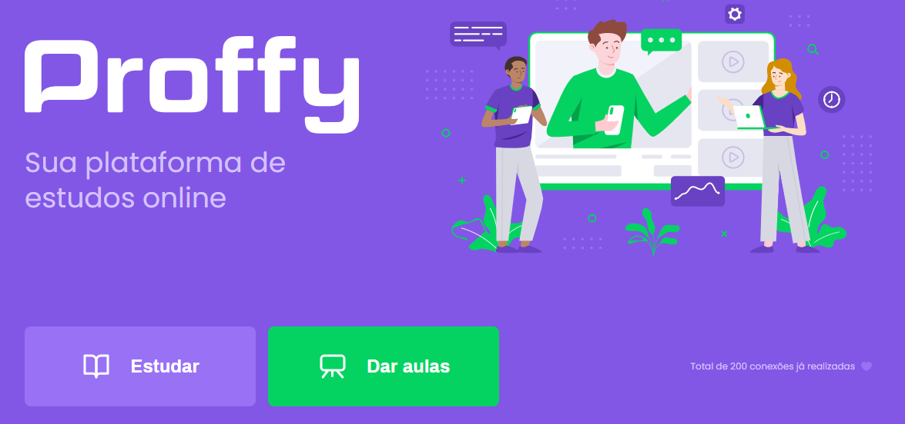

<h1 align="center">
    
</h1>

  

  

  

  

_________

## 💻 Sobre o projeto

📚 Proffy - Plataforma de Estudos Online.

Proffy é uma forma de conectar alunos e professores.

No Proffy, você professor pode cadastrar suas aulas, horários, dados de contato e valor da aula. 

E para os alunos é possível encontrar um professor e entrar em contato com o mesmo para começar sua aula.
 

Projeto foi desenvolvido durante a **NLW - Next Level Week 2** oferecida pela [Rocketseat] 🚀.

O NLW é uma experiência online com muito conteúdo prático, desafios e hacks onde o conteúdo fica disponível durante uma semana.

_________

## 🎨 Layout

O layout da aplicação está disponível no [Figma].

_________

## 🛠 Tecnologias

As seguintes ferramentas foram usadas na construção do projeto:
 
 - [HTML5]
 - [CSS3]
 - [JavaScript]

 - [NodeJS]
 - [Nunjucks]
 - [Nodemon]
 
 - [npm]
 - [ExpressJS]

- Programado no [Visual Studio Code].

_________

## 🚀 Como executar o projeto

    # Clone esse repositório
    $ git clone https://github.com/philipeperete/NextLevelWeek2
    
    # Instalar dependências
    $ npm install  
    
    # Executar
    $ npm run dev

_________

## 💡 Pré-requisitos

Antes de começar, você vai precisar ter instalado em sua máquina as seguintes ferramentas:
[Git](https://git-scm.com).
Além disto é bom ter um editor para trabalhar com o código como [Visual Studio Code].

_________ 

## 📝 Licença

O projeto se encontra sob licença MIT.

Para mais detalhes, acesse [license](LICENSE).

_________

Agradecimentos [Rocketseat] 🚀.

* Twitter: [Philipe Perete](https://twitter.com/PhilipePerete).
* Linkedin: [Philipe Perete](https://www.linkedin.com/in/philipe-perete-b76622104/).
* Github: [Philipe Perete](https://github.com/philipeperete).

Feito com 💙 por **Philipe Perete** 👻.

[Rocketseat]: https://rocketseat.com.br
[Figma]: https://www.figma.com/file/GHGS126t7WYjnPZdRKChJF/?viewer=1&node-id= 

[HTML5]: https://developer.mozilla.org/en-US/docs/Web/Guide/HTML/HTML5
[CSS3]: https://developer.mozilla.org/en-US/docs/Archive/CSS3 
 
[JavaScript]: https://www.javascript.com/  

[ExpressJS]: https://expressjs.com/
[Nunjucks]: https://mozilla.github.io/nunjucks/templating.html
[Nodemon]: https://nodemon.io/
[NodeJS]: https://nodejs.org/
[npm]: https://www.npmjs.com/get-npm

[Visual Studio Code]: https://code.visualstudio.com/ 